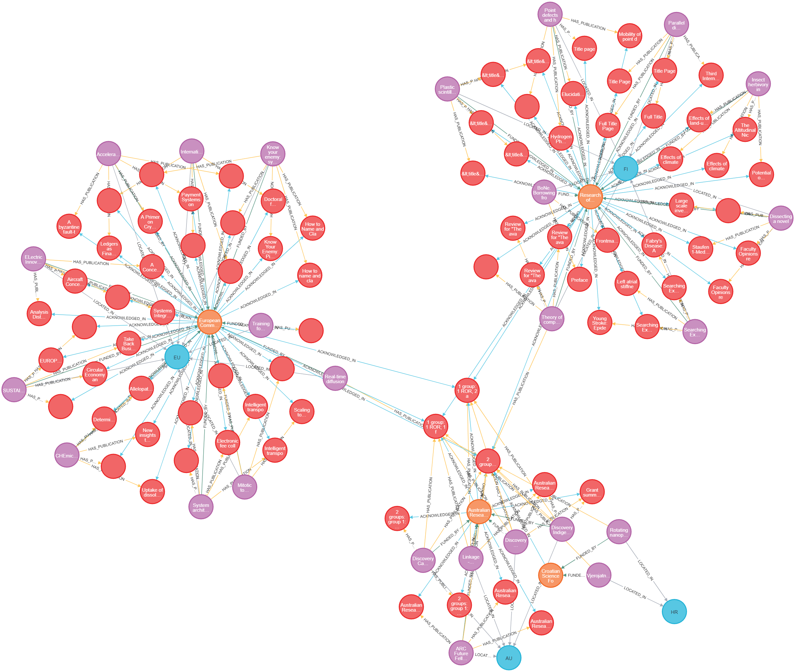
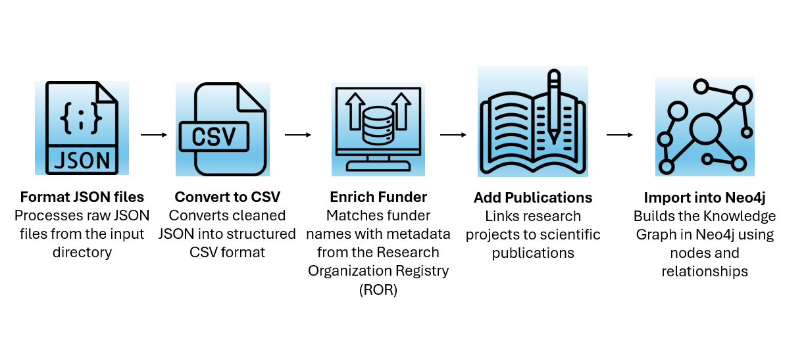

# OpenAIRE Knowledge Graph Importer for Neo4j
This tool-pipeline enables you to import data from the OpenAIRE Knowledge Graph into a local Neo4j database for custom analysis, exploration, and potential knowledge graph enrichment.

It is designed to process OpenAIRE-provided CSV datasets and construct a structured knowledge graph focused on international funded research projects. Currently, it supports project-related data, including relationships to funders and countries, offering insights into the global landscape of open science initiatives. The resulting graph can be explored using Cypher queries or visualized through tools like Neo4j Browser and Neo4j Bloom.

### 🔄 Data Processing Pipeline

Each step is explained in detail in our documentation.

📄 **Read full documentation here**  [documentation/project_pipeline.md](documentation/project_pipeline.md)

